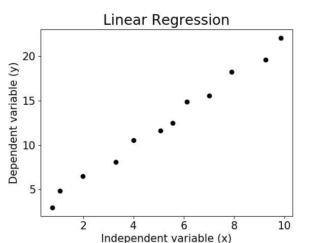
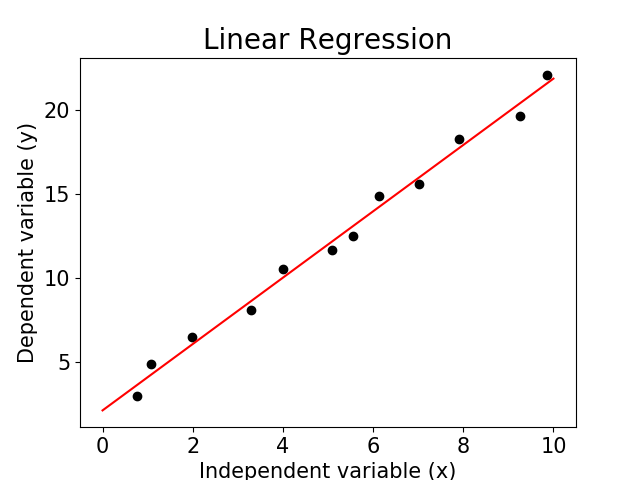

# Linear Regression Model

## Definition

Linear Regression is a methodology that allows us to relate two phenomena. This approach allows identifying a rule based on real data to predict new values. There are algorithms and packages that perform linear regression in a simple way, but we don't aways understand what's going on behind the curtains. The purpose of this presentation is to expose the mathematical foundations of the linear regression.

## The method

The method can divided into three steps:

* Initial view of data;
* Determination of parameters;
* Generate the curve found parameters.

### Initial view of data

The objective of this step is to verify if the data follow an approximately linear behavior. Otherwise, the linear regression method should not be applied. Let's consider the following dateset.

| x | y | 
|--- |--- |
| 0.771505 | 2.95689 | 
| 1.074600 | 4.86138 | 
| 1.991260 | 6.50216 |
| 3.299730 | 8.08435 |              
| 3.994620 | 10.5455 | 
| 5.081320 | 11.6296 |
| 5.561830 | 12.5086 |
| 6.123660 | 14.8819 | 
| 7.018150 | 15.5851 |
| 7.897850 | 18.2513 | 
| 9.250670 | 19.6284 |
| 9.856850 | 22.0896 |
 
 We can plot these data and check their behavior. In the image below we can see that the graph demonstrates a linear behavior, therefore the application of the linear regression technique is justified.

 
In this repository I have provided a python code that generates a curve fitting using linear regression, as I said, the mathematial foundations are suppressed and we have no idea of what happens internally. The code generates the image below.

~~~python
from numpy import loadtxt, linspace
from pylab import scatter, plot, show, xlabel, ylabel, title, tick_params
from scipy.optimize import curve_fit

def func_fit(x, a, b):
    return a*x+b

data = loadtxt("data.dat",float)
xdata = data[:,0]
ydata = data[:,1]
xcurv = linspace(0,10,100)
ycurv = []

param,pcov = curve_fit(func_fit, xdata, ydata)
a = param[0]
b = param[1]

#Curve Fit
for x in xcurv:
    ycurv.append(func_fit(x, a, b))

print("============================")
print("Parameters:")
print("   a = ",a)
print("   b = ",b)
print("\n")
print("Covariance matrix: ")
print(pcov)
print("============================")

scatter(xdata, ydata, color='black')
plot(xcurv,ycurv, color='red')
xlabel("Independent variable (x)", fontsize = '15')
ylabel("Dependent variable (y)", fontsize = '15')
title("Linear Regression", fontsize = '20')
tick_params(labelsize='15')
show()
~~~

 

### **Determining the parameters**

To determine the parameters $a$ and $b$ of the curve, we will use the least squares method. In this method, the values $a$ and $b$ are obtained in such a way that the sum of squares of the differences between the observed values of $Y$ and those obtained from the adjusted curve for the same values of $X$ is minimal. Mathematically this idea can be represented as:

 

$\sum ê = \sum (Y-Ŷ)^2 = \sum (Y - a - bX)^2$

where $ê = Y-Ŷ$

 

To find the minimum configuration we can derive the above expression with respect to parameters $a$ and $b$ and set it equal to zero.

 

$\frac{d}{da}\sum ê^2 = \frac{d}{da}\sum (Y - a - bX)^2 = -2\sum (Y-a-bX) = 0 (I)$

 

$\frac{d}{db}\sum ê^2 = \frac{d}{db}\sum (Y - a - bX)^2 = -2\sum (Y-a-bX)x = 0 (II)$

 

Knowing that $n$ is the number of observations, we can write equations $(I)$ and $(II)$ as equations $(III)$ and $(IV)$ as follows.

 

$\sum Y = na + b \sum X$

 

$\sum XY = a \sum X + b \sum X^2$ 

 

To determine the parameter $b$, we divide the first equation by $n$ and isolate $a$ in order to substitute it in the second equation:

$\frac{1}{n}\sum Y = \frac{na}{n} + \frac{b}{n}\sum X$

 

$\bar{Y} = a + b\bar{X}$

 

$a = \bar{Y} - b\bar{X}$

 

Substituting in the second equation:

 

$\sum XY = a\sum X + b\sum X^2$

 

$\sum XY = \bar{Y}\sum X - b\bar{X} \sum X + b \sum X^2$

 

$\sum XY = \bar{Y} \sum X + b(\sum X^2 - \bar{X \sum X})$

 

$b(\sum X^2 - \bar{X} \sum X) = \sum XY - \bar{Y} \sum X$

 

$b = \frac{\sum XY - \bar{Y}\sum X}{\sum X^2 - \bar{X}\sum{X}}$

 

The linear coefficient of the line can be easily determined by the equation $a = \bar{Y} - b\bar{X}$ already defined above.

 

$a = \bar{Y} - b\bar{X}$

 

$a = \bar{Y} - \left( \frac{\sum XY - \bar{Y}\sum X}{\sum X^2 - \bar{X}\sum{X}} \right ) \bar{X}$

 

We can calculate these parameters directly from the data, without using the scipy package through the code below:

~~~python
sumx = sum(xdata)
sumy = sum(ydata)    
medx = sumx/12.0
medy = sumy/12.0
sumx2 = 0
sumxy = 0

for i in range(12):
    sumx2 = sumx2 + (xdata[i])**2
    sumxy = sumxy + xdata[i]*ydata[i]

b = (sumxy - medy*sumx)/(sumx2 - medx*sumx)
a = medy - b*medx

print("\n\n angular coefficient: ",b)
print("Lienar coefficient: ",a)
~~~

And finally, after obtaining the linear coefficient $a$ and the angular coefficient $b$, we can plot the fit curve.

